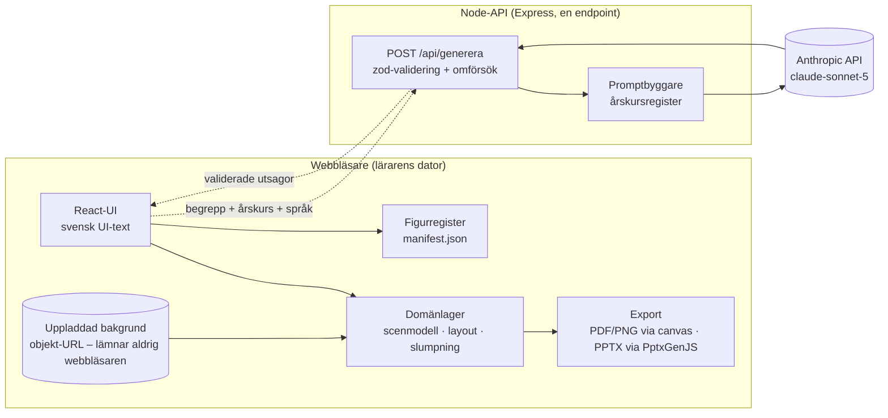
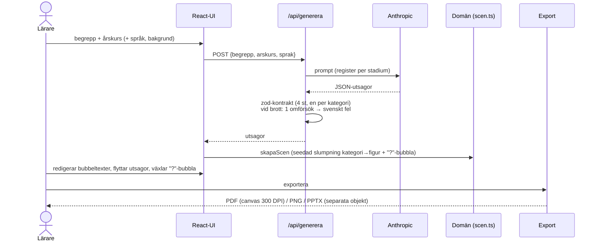

# ARCHITECTURE — Diskussionsunderlag

## Systemöversikt

API-nyckeln finns endast i serverns `.env`. Det enda som lämnar webbläsaren är
begrepp, årskurs och språk.

## Flödet generera → redigera → rendera → exportera

## Lagerkarta

| Lager | Kod | Beroenden |
|---|---|---|
| Domän (källa till sanning) | `src/domain/` | inga — ren TS, fullt enhetstestad |
| AI-adapter | `src/ai/` (klient, mock) + `server/` (prompt, kontrakt) | domän |
| Assets-register | `src/domain/figurer.ts` + `public/figurer/manifest.json` | — |
| UI | `src/ui/` | domän, ai, export |
| Export | `src/export/` | domän |

Domänlagret vet inget om React, canvas eller Anthropic — samma scenmodell driver
editorn (SVG), PDF-exporten (canvas) och PPTX-exporten (native objekt), vilket
garanterar att det läraren ser är det som exporteras.

## Källa till sanning vs genererat

- Källa: `src/`, `server/`, `public/figurer/` (inkl. manifest), dokumenten.
- Genererat (checkas aldrig in): `dist/`, `node_modules/`, exporterade filer.
